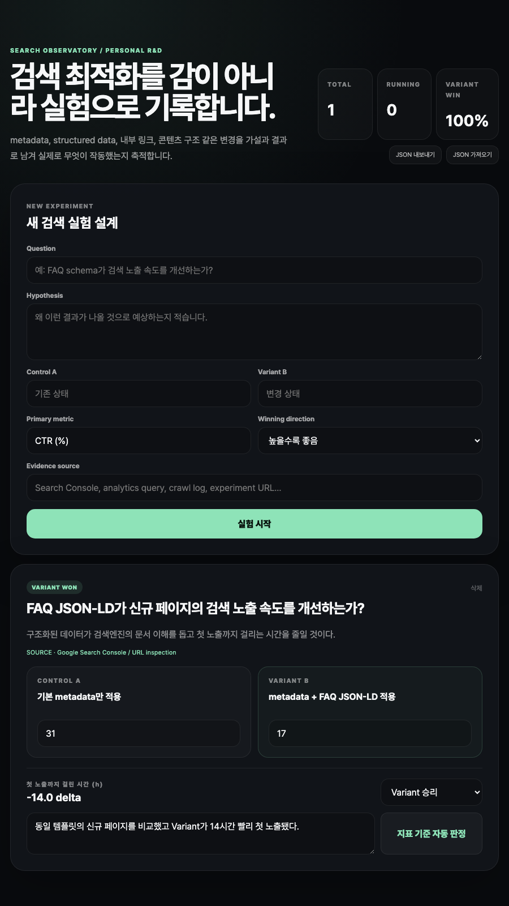

# Search Observatory

Search Observatory is a personal SEO/search R&D notebook for designing controlled experiments and keeping the evidence needed to reproduce them.

Instead of collecting generic optimization checklists, the app stores a question, hypothesis, control, variant, primary metric, expected metric direction, evidence source, observations, and final outcome for each experiment.

## Measurement discipline

The experiment judge no longer declares a winner from one control value and one variant value. Each arm accepts repeated observations, computes the mean effect in the declared metric direction, and uses a fixed-seed non-parametric bootstrap. Fewer than three observations per arm, or a 95% interval crossing zero, is reported as **inconclusive** rather than a win.

The checked-in `benchmarks/experiment-judge.json` is a synthetic protocol verification artifact, not an SEO performance claim. It records the fixed seed, bootstrap configuration, Git revision, and explicit limitations. Run `npm run check` to reproduce the tests, benchmark artifact, and production build.

## Product preview

| Experiment workspace | Research notebook view |
| --- | --- |
|  |  |

The first view shows the control/variant experiment setup and metric direction controls. The second captures the longer notebook layout used to keep evidence, observations, and portable experiment history together.

## Current capabilities

- Control/variant experiment design
- Explicit “higher is better / lower is better” metric direction
- Result entry and automatic winner judgement
- Evidence-source and observation notes
- Local persistence
- Versioned JSON export/import for reproducibility and backup
- Running/completed experiment summary

## Example research questions

- Does structured data reduce time to first search appearance?
- Does an internal-link change improve organic CTR?
- Does a title-template change improve impressions without hurting CTR?
- Does content restructuring change crawl or indexing behaviour?

## Stack

- Next.js 16.3.3
- React 19
- TypeScript
- App Router

## Development

```bash
npm install
npm run dev
```

Production build:

```bash
npm run build
```

## Deployment

Portfolio deployment: `https://search-observatory.oosu.dev`
